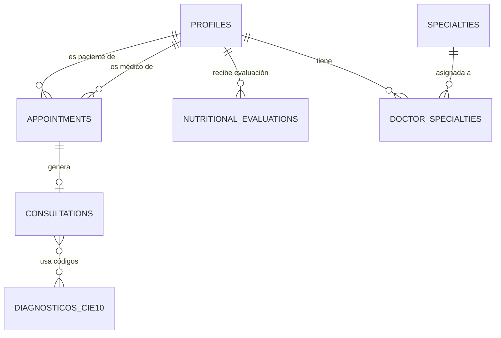

# Análisis de Flujos y Relaciones de Datos - Alcaraván Health

Este documento detalla la estructura relacional y los flujos lógicos detectados en los archivos SQL de la carpeta `/Tablas`.

## 1. Mapa de Relaciones (Diagrama Lógico)

## 2. Flujos Principales

### A. Flujo de Atención Médica
1.  **Registro/Perfil**: Un usuario se crea en `profiles` con el rol `paciente` o `doctor`.
2.  **Cita (`appointments`)**: Se agenda un encuentro vinculando un `patient_id` con un `doctor_id`.
3.  **Consulta (`consultations`)**: Una vez realizada la cita, se genera un registro en esta tabla que hereda el `appointment_id`. Aquí se almacenan:
    *   Signos vitales.
    *   Diagnóstico (vinculado a códigos CIE-10).
    *   Recetas y solicitudes de exámenes (en formato JSON).

### B. Flujo Nutricional
1.  **Evaluación (`nutritional_evaluations`)**: El nutricionista registra métricas antropométricas (cintura, cadera, peso) y hábitos.
2.  **Análisis de IA**: El campo `ai_summary` almacena la interpretación generada por Gemini basándose en las métricas y hábitos registrados.

---

## 3. Análisis de Campos Críticos

| Tabla | Campo Clave | Observación |
| :--- | :--- | :--- |
| `profiles` | `role` | Define los permisos en la App (RBAC). |
| `consultations` | `diagnosis` | Almacena un array JSON de objetos CIE-10. |
| `nutritional_evaluations` | `metrics` | JSON con medidas físicas para cálculos de IMC e ICC. |

---

## 4. Hallazgos e Inconsistencias Detectadas ⚠️

Tras revisar los datos de los archivos `_rows.sql`, se han detectado los siguientes puntos que "no cuadran" o requieren atención:

### 1. Datos Físicamente Imposibles (Test Data)
En `consultations_rows.sql` y `nutritional_evaluations_rows.sql` hay registros con valores fuera de rango biológico:
*   **Signos Vitales**: Consulta `03b6ebab...` registra `heart_rate: 1` y `temp_c: 12.0`. Un ser humano no sobrevive a esos valores.
*   **Métricas Nutricionales**: Evaluación `c9d9182b...` registra `height: 12cm` y `weight: 12kg`, lo que resulta en un **IMC de 833.3**.

### 2. Inconsistencia en Cálculos de Riesgo (ICC)
*   En la evaluación `0cc8548a...`, se registra `waist: 80` y `hip: 12`. Esto da un **ICC (Índice Cintura-Cadera) de 6.67**. El rango normal es cercano a 0.8 - 1.0. Esto sugiere que los datos de prueba no validan la lógica de negocio.

### 3. Campos Nulos en Perfiles
*   Muchos registros en `profiles` tienen `cedula`, `birth_date` y `gender` como `null`. Si el sistema requiere estos datos para historias médicas legales, deberían ser obligatorios en el backend.

### 4. Relación Médica Duplicada
*   En `consultations`, se repiten los campos `doctor_id` y `patient_id`, los cuales ya están presentes en la tabla `appointments`. 
*   *Recomendación*: Se podría simplificar la tabla `consultations` dejando solo el `appointment_id` para evitar redundancia de datos (Normalización).
